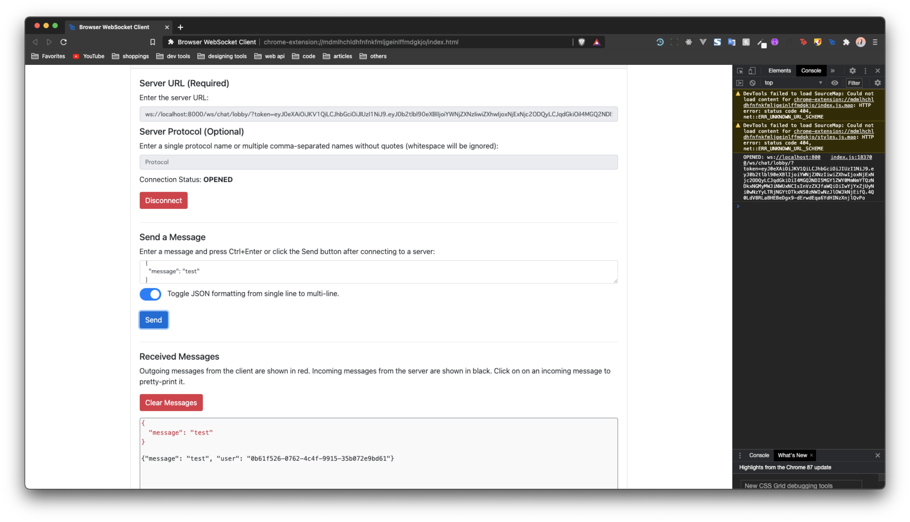

# django-channels-jwt-auth-middleware

Custom AuthMiddlewareStack to get users from JWT token for Django Channels.

## Installation

Simply,

```bash
$ pip install django-channels-jwt-auth-middleware
```

And that it.

## Usage

All you have to do is wrap your URLRouter.

```py
from django_channels_jwt_auth_middleware.auth import JWTAuthMiddlewareStack

application = ProtocolTypeRouter({
    "http": get_asgi_application(),
    "websocket": JWTAuthMiddlewareStack(
        URLRouter(
            websocket_urlpatterns,
        )
    ),
})
```

Then, add your JWT token to your websocket path.

```
/path/to/consumer/?token=<your JWT token>
```

`JWTAuthMiddlewareStack` will get the user_id from your JWT and get the user based on it. If it finds the user then it will attach that user to `self.scope['user']`. If it does not find a user the Middleware will sttach an AnonymousUser to the scope.

`AuthMiddlewareStack` is already in `JWTAuthMiddlewareStack`. If you want to change this, simply do;

```python
from django_channels_jwt_auth_middleware.auth import JWTAuthMiddleware

from . import YourCustomMiddlewareStack

def CustomJWTAuthMiddlewareStack(app):
    return JWTAuthMiddleware(YourCustomMiddlewareStack(app))
```

Simple as that :)

## Testing

Testing is done by two methods.

1. automated testing using django's test system.
2. manual testing by hand.

I have tried testing the middleware through `ChannelsLiveServerTestCase`, but currently this does not run due to pickle error in multiprocessing package from python.  
For this reason no-token test cases were tested using django's test system using a test project, and test cases with jwt token is tested by hand.  
For hand testing chrome extension called `Browser WebSocket Client` was used. Blow is a simple evidence from the hand testing.




If you go to `testproject/pages/tests.py` you will see the consumer that is used for testing.

```py
class TestConsumer(WebsocketConsumer):
    def connect(self):
        self.accept()

    # def disconnect(self, code):
    #     self.disconnect()

    def receive(self, text_data, bytes_data=None):
        context = {
            'message': 'testing consumer',
        }
        user = self.scope['user']
        if (user_id := user.id):
            context.update({'user': str(user_id)})
        else:
            context.update({'user': None})
        self.send(text_data=json.dumps(context))
```

simply, if a data is passed in to the websocket it will return a user id of None for AnonymousUser.
